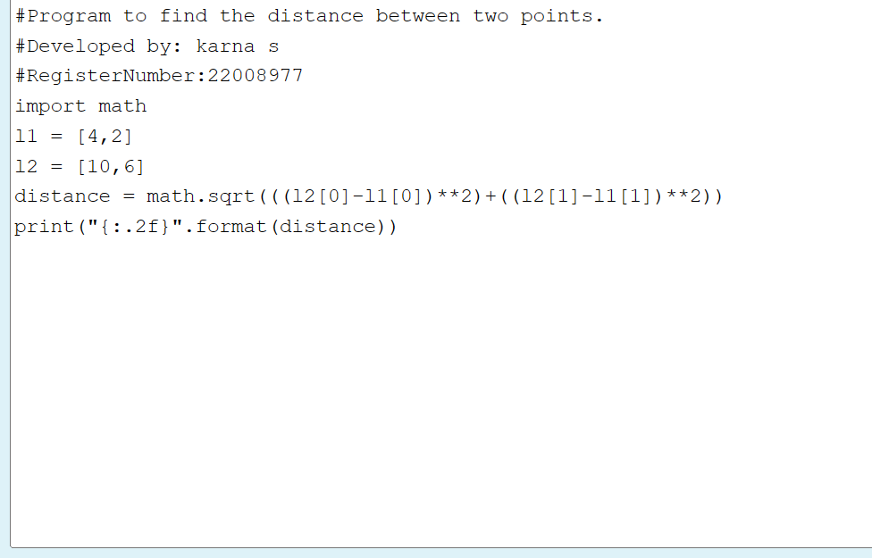

# DISTANCE-BETWEEN-TWO-POINTS

## AIM:
To write a python program to find the distance two 2 points
## ALGORITHM:
### Step 1: Get the two values from the user
### Step 2: Import Math function
### Step 3: Substitute the values in the distance formula  
### Step 4: Print the value
### Step 5: End the program
### PROGRAM:
  
    

 
  

### OUTPUT:
 

### RESULT:
 Thus the program for Distance Between Two Points is written and verified

